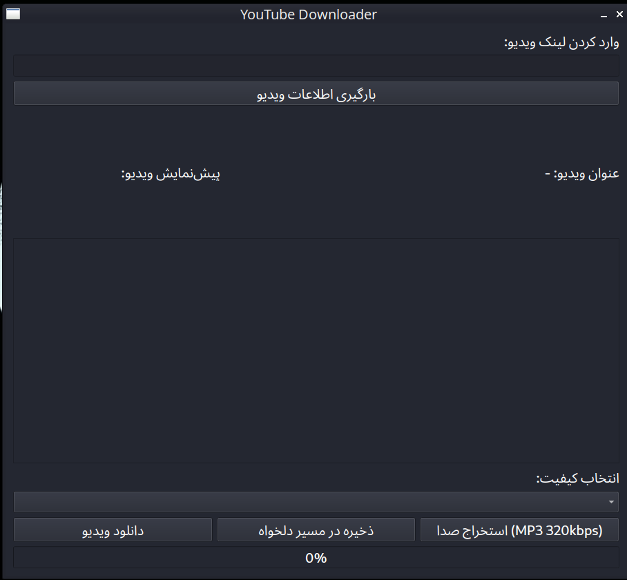

# YouTube-Downloader

یک ابزار گرافیکی برای دانلود ویدیو و استخراج صدا از ویدیوهای یوتیوب است که با استفاده از کتابخانه‌های PyQt6، yt-dlp و ffmpeg توسعه یافته است. این برنامه به شما امکان می‌دهد تا لینک ویدیوی یوتیوب را وارد کنید، کیفیت‌های موجود را مشاهده کنید، ویدیوی مورد نظر را با کیفیت دلخواه دانلود کنید یا صدای آن را به فرمت MP3 با بیت‌ریت 320kbps استخراج کنید.

ویژگی‌ها

دانلود ویدیو: دانلود ویدیوها با کیفیت‌های مختلف (مانند 720p، 1080p و غیره).

استخراج صدا: تبدیل ویدیو به فایل صوتی MP3 با کیفیت بالا.

پیش‌نمایش ویدیو: نمایش عنوان و تصویر بندانگشتی (thumbnail) ویدیو.

انتخاب مسیر ذخیره‌سازی: امکان ذخیره فایل‌ها در مسیر دلخواه یا دسکتاپ.

پشتیبانی از سیستم‌عامل‌ها: ویندوز و لینوکس.

پیش‌نیازها

برای اجرای این برنامه، باید موارد زیر را نصب کنید:

Python 3.8 یا بالاتر: برای اجرای اسکریپت.

PyQt6: برای رابط کاربری گرافیکی.

yt-dlp: برای دانلود ویدیوها از یوتیوب.

ffmpeg: برای استخراج صدا و پردازش ویدیوها.

مرورگر فایرفاکس (اختیاری): برای استفاده از کوکی‌های مرورگر جهت دانلود ویدیوهای محدود شده.

نصب پیش‌نیازها

در لینوکس:

sudo apt update

sudo apt install -y ffmpeg

pip install pyqt6 yt-dlp

در ویندوز:

Python را از python.org نصب کنید.

ffmpeg را از ffmpeg.org دانلود و به PATH سیستم اضافه کنید.

دستورات زیر را در Command Prompt اجرا کنید:

pip install pyqt6 yt-dlp

نحوه اجرا

فایل ud.py را دانلود کنید.

در ترمینال یا Command Prompt به دایرکتوری فایل بروید.

دستور زیر را اجرا کنید:

python ud.py

سیستم‌عامل‌های پشتیبانی‌شده

ویندوز: Windows 10 و بالاتر

لینوکس: توزیع‌های مبتنی بر اوبونتو و سایر توزیع‌ها با پشتیبانی از ffmpeg

YouTube Downloader

This is a graphical tool for downloading videos and extracting audio from YouTube videos, developed using PyQt6, yt-dlp, and ffmpeg. It allows you to input a YouTube video link, view available quality options, download the video in your desired quality, or extract its audio as an MP3 file with a 320kbps bitrate.

Features

Video Download: Download videos in various qualities (e.g., 720p, 1080p, etc.).
Audio Extraction: Convert videos to high-quality MP3 audio files.
Video Preview: Display the video title and thumbnail.
Custom Save Path: Save files to a custom directory or the desktop.
Platform Support: Windows and Linux.

Prerequisites

To run this program, you need to install the following:

Python 3.8 or higher: For running the script.
PyQt6: For the graphical user interface.
yt-dlp: For downloading videos from YouTube.
ffmpeg: For audio extraction and video processing.
Firefox Browser (optional): For using browser cookies to download restricted videos.

Installing Prerequisites

On Linux:

sudo apt update
sudo apt install -y ffmpeg
pip install pyqt6 yt-dlp

On Windows:

Install Python from python.org.
Download ffmpeg from ffmpeg.org and add it to your system PATH.
Run the following commands in Command Prompt:

pip install pyqt6 yt-dlp

How to Run

Download the ud.py file.
Navigate to the file's directory in a terminal or Command Prompt.
Run the following command:

python ud.py

Supported Operating Systems

Windows: Windows 10 and above
Linux: Ubuntu-based distributions and other distributions with ffmpeg support

 
